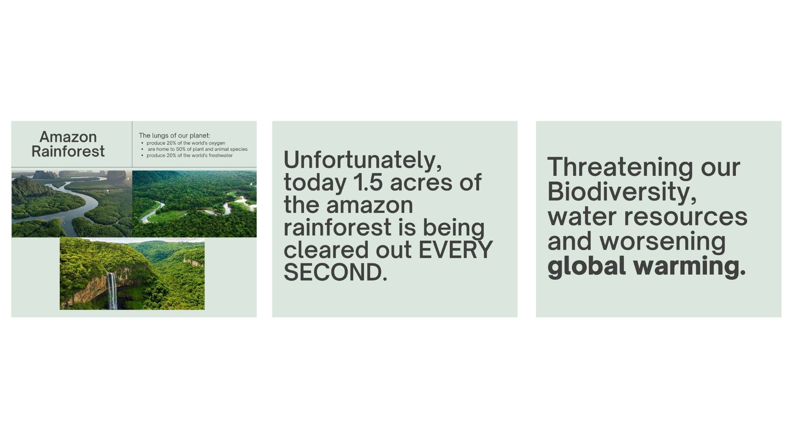
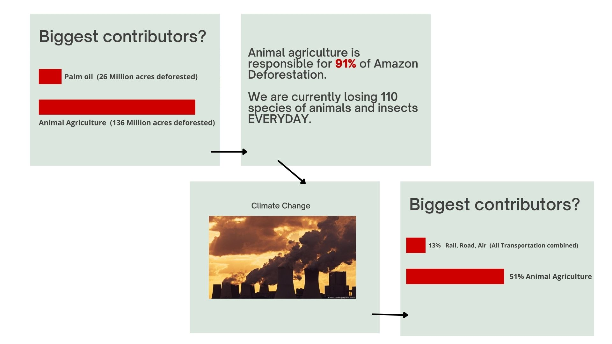
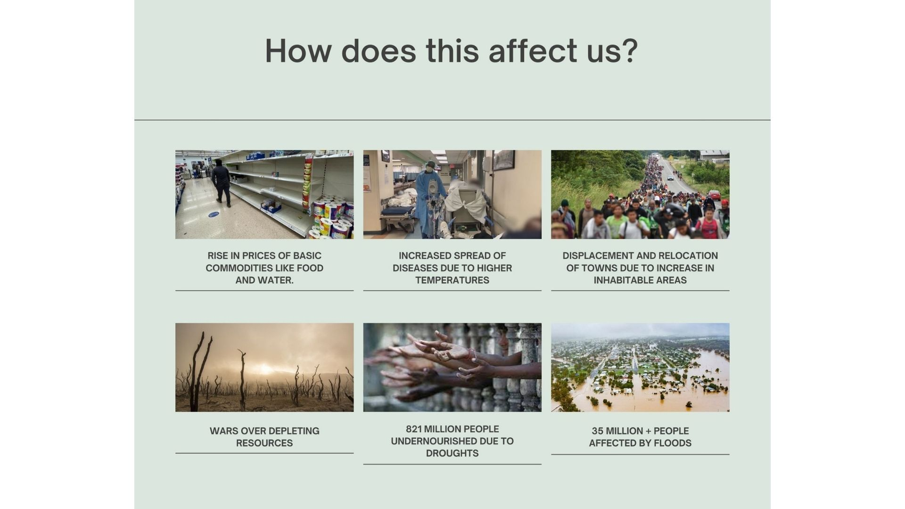
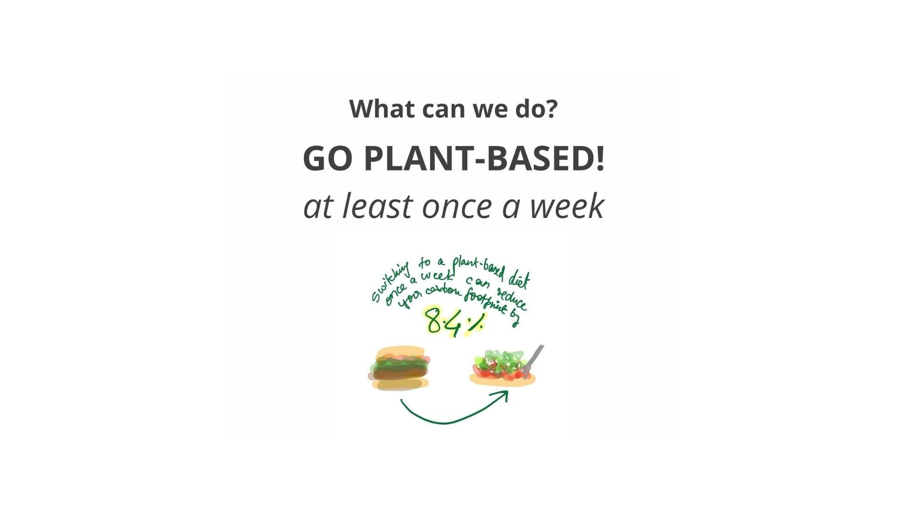
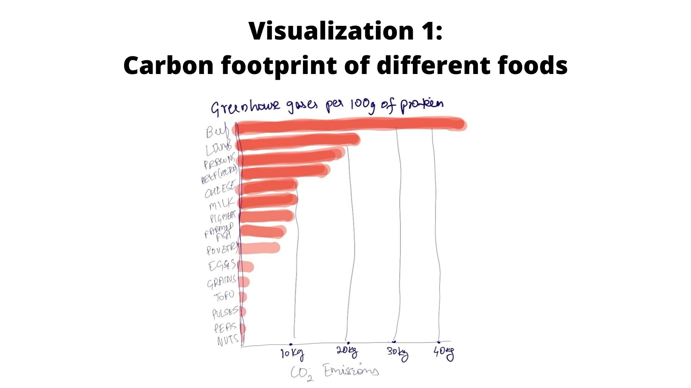
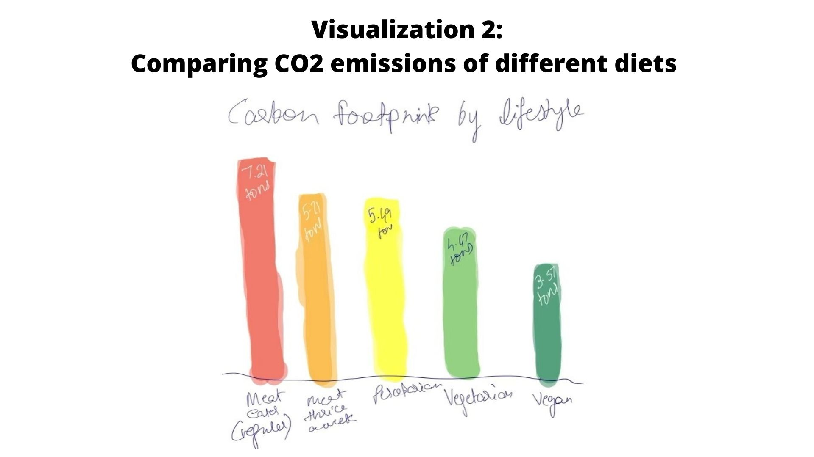
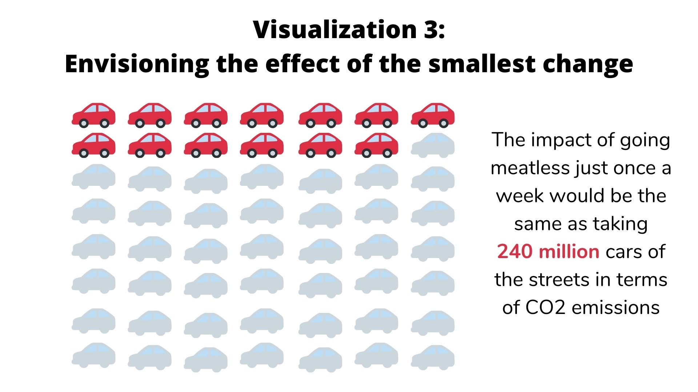

**FINAL PROJECT- PART 2**
----

**TOPIC: TACKLE GLOBAL WARMING WITH THE POWER OF YOUR FORK**

Feedback:

**1.	Do you find the wireframe/storyboard clear and understandable?**

Respondent 1: Yes, I see continuity in the content with clarity.

Respondent 2: No, maybe you can elucidate more on your implications and transitions from slide 1-2-3

**2.	What changes can I make?**

Respondent 1: Maybe show different vegetarian alternatives for regular meat consumers; products like beyond meat.

Respondent 2: As i stated ^

**3.	Do you find yourself engaged?**

Respondent 1:	Yes, I did get enough insight on what the causes and effects are.

Respondent 2: Sure.. I kinda want to read more to see where this is going

**4.	What is the call to action?**

Respondent 1: To encourage and act on balancing out the food intake; in terms of green house effect and animal agriculture.

Respondent 2: Go vegan?

**5.	As a reader, how do you find the tone of the storyboard? What emotions does it evoke, if any?**

Respondent 1: Being a meat eater, thrice every week, yet again it has left as impact on me and time and again reminded about the sincerity of the situation. I definitely plan on taking a strict action on it soon.

Respondent 2: I think it reaches consensus before fully convincing the reader

**6. Do you have any other thoughts?**

Respondent 1: I think the questions covered it all

Respondent 2: I think you can make a more sound/ persuasive argument

----

As a part of my final project, I intend to show the visualizations the way I have shown in part 1 and 2 since they are very clear to understand. In part 3, I will be adding additional supporting materials and attempting to simplify the complex correlations between multiple datasets.

Based on my user research and interviews, I have realized that I can definitely make a more compelling argument. My struggle is that the core datasets I have are so raw that the correlation is made based on a combination of multiple data sets. Therefore, you will find more sources than usual. For example, the energy required to produce every type of food + the output (calories/energy consumable). There are plants that humans can directly consume and then there are plants that animals consume that we humans consume. In essence, cows, hens, etc. act as middlemen in the food intake system. The data findings for this topic are available but extremely difficult to navigate around. So to be effective I have to explain what the findings are based on, without making it overwhelming while still showing the research behind it.

As far as the narrative goes, I have decided to narrow it down simply to deforestation and CO2 emissions even though there are many more environmental consequences. Ultimately, I understand the data visualizations I present have to be informed with sound research and therefore, based on my progress in research, I might make minor tweaks in the content I present. 

----

SOURCES-

https://gelr.org/2015/10/23/a-leading-cause-of-everything-one-industry-that-is-destroying-our-planet-and-our-ability-to-thrive-on-it-georgetown-environmental-law-review/

https://www.cowspiracy.com/

https://link.springer.com/content/pdf/10.1007/s10584-014-1169-1.pdf

https://academic.oup.com/ajcn/article/78/3/660S/4690010

https://data.nal.usda.gov/dataset/data-gas-emissions-dairy-barnyards

https://iopscience.iop.org/article/10.1088/1748-9326/aa6cd5

https://www.pnas.org/content/116/46/23357
