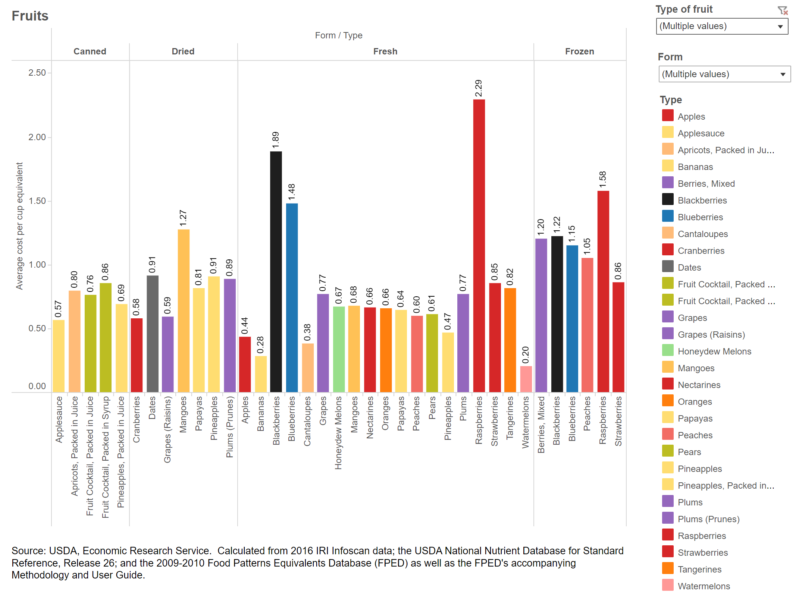
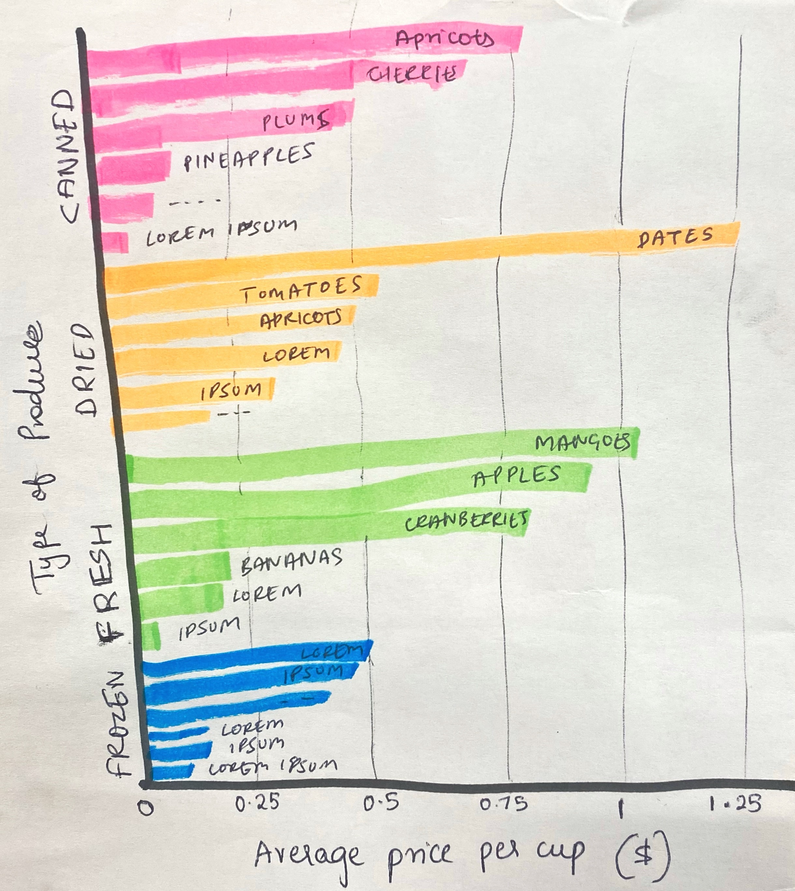
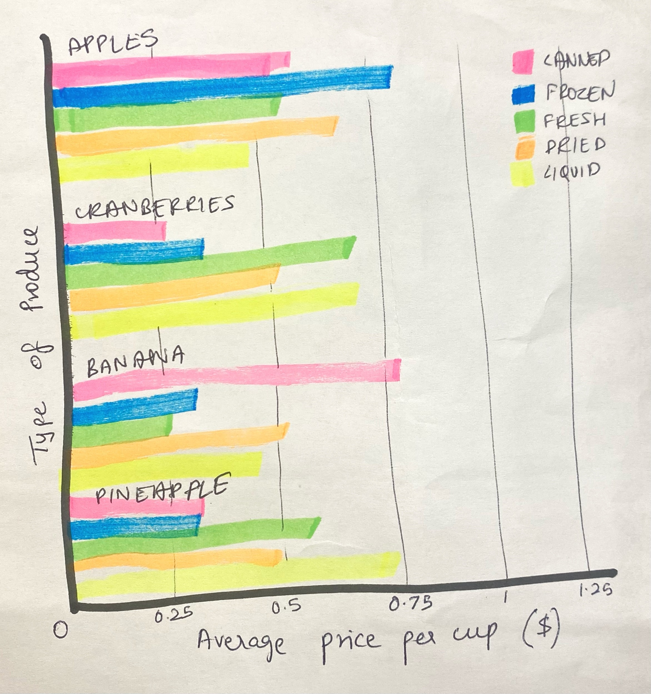

Assignment 3 & 4- Critique by Design

---- 

**USDA ERS ORIGINAL VISUALIZATION**

**CRITIQUE**

Type of Visualization: I like the idea of using column chart for categorical differentiation and comparison of prices. It’s simple and serves the purpose.

Interaction: I like that the visualization is interactive and the viewer can manually choose which category (frozen/fresh/canned) they want to look and even filter the fruits/vegetables they want to compare. The way it is done here gives the viewer the freedom to look at data that’s relevant to them. 

Metric: The average price is measured in cups and in my opinion that is not the ideal metric to use when you’re weighing fresh produce along with canned, frozen, etc. Perhaps the ideal metric would be pounds because users may not know how to perceive one cup of say, fresh apples.

Color Allocation: The colors at first seem extremely random. However, upon analyzing further you can see the designer has used orange for oranges, green for spinach, yellow for corn, etc. The problem arises when we have multiple fruits and vegetables with the same colour. For example, if you can see, apples, cranberries and nectarines are all red with only a slight difference of hue/brightness. Similarly, all green veggies like kale, spinach, asparagus, avocado, broccoli, okra, etc. have green bars. 
In terms of organizing the fruits and vegetables, I understand that the designer has chosen to arrange them on the x axis alphabetically. But I find that different values of products in their respective categories is resulting in visual haphazardness here. While I see the data, I don’t know what story it’s telling.

Labels: In terms of labels on the x axis, having them at an orientation of 90 degrees results in having the reader tilt their neck to read the categories. This obviously makes it inconvenient for the audience and also breaks the flow causing an interruption in grasping the information being communicated. 
On the y axis, I would assume the numbers I see are in dollars. However, with the lack of $ sign, I cannot guarantee that.

So, if I re-did the visualization, I would stick to the visualization type as I think it is appropriate for the data. However, I would opt for a bar chart instead of column chart for better readability of labels. In terms of grouping similar variables together, I would either group all products in the different forms they are consumed, such as- fresh, frozen, canned, etc.; or, I would segregate the data as per the fruit/vegetable and have bars (representing the form they are consumed in) and club them on the basis of product type. My sample sketches on paper will convey the two ideas. 

This information is relevant to any and everyone since we all consume fruits and vegetables. The tool is useful for those who want to identify the different price points of fruits and vegetables and their pricing and differences in the pricing based on the consumed forms.

However, to narrow down, this tool is most useful for understanding food security, resource allocation, inflation of prices of basic necessities, or making business decisions- especially if one is into agriculture or uses fruits/vegetables as raw materials for their products. This is an extremely broad market so this visualization can be perceived in many ways and the implications can be abundant. Since the interactive nature of this visualization allows the user to see the data that’s relevant to them, I believe it is an effective one.

**WIREFRAMING SOLUTIONS AND INTERVIEW RESPONSES**

Graph 1:

**Q. Can you tell me what you think this is?**

Respondent 1: A visual representation of fruits sold in various forms/packaging and the average price per cup. Also, how nutrient-rich they are based on the way they’re packed/sold

Respondent 2: These graphs are telling me the average price per cup, in US dollars, for different fruits as per their type of produce.

**Q. Can you describe to me what this is telling you?**

Respondent 1:  Apples (considered an less elite fruit compared to the others) is priced more (it should prolly be around as much as bananas?)

Respondent 2:  It is easy to visualize the price per cup for all the fruits that fall under a particular category of type of produce.

**Q. Is there anything you find surprising or confusing?**

Respondent 1: What surprising to me is the stark difference in price of canned apricots from dried apricots - I think this may be because canned apricots are fresher than dried ones and so have more nutrients

Respondent 2: I did not find anything surprising or confusing but would like to add that the type of categorization used in both the graphs solely depends on the usage

**Q. Who do you think is the intended audience for this?**

Respondent 1: Homemakers/mothers, grocers, other parties (like ketchup brands for tomatoes, jam brands for mangos, etc etc)

Respondent 2: The intended audience would be those business groups who aim for manufacturing packaged products made from fruits. The interpretation would also be useful for startups who seek to enter the market with budgeting constraints.

**Q. Is there anything you would change or do differently?**

Respondent 1: No

Respondent 2: Other than the two mentioned graphs, I would make one more graph (a vertical bar graph) that would denote all the fruits and their type of produce within the range of all prices shown. Only to know my options for the product(s) that are within a specific price per cup. This information would be useful for retail market where they can choose the products they get in for sale.

Graph 2:

**Q. Can you tell me what you think this is?**

Respondent 1: This is definitely a better way of visually representing what you’re trying to explain - type of packaging and nutrient level as to price per cup 

Respondent 2: These graphs are telling me the average price per cup, in US dollars, for different fruits as per their type of produce.

**Q. Can you describe to me what this is telling you?**

Respondent 1: Frozen apples and canned bananas incur similar costs in terms of harvesting (maybe even nutrient levels?)

Respondent 2: It is easy to visualize the price per cup for all the types of produce for any mentioned fruit

**Q. Is there anything you find surprising or confusing?**

Respondent 1: It's a little too much

Respondent 2: I did not find anything surprising or confusing but would like to add that the type of categorization used in both the graphs solely depends on the usage. 
For instance; if I were to know the types of produce that exceed a certain amount per cup for a specific fruit then graph 2 would be preferred for less confusion. Similarly the other way around for graph 1.

**Q. Who do you think is the intended audience for this?**

Respondent 1: Same as above

Respondent 2: The intended audience would be those business groups who aim for manufacturing packaged products made from fruits. The interpretation would also be useful for startups who seek to enter the market with budgeting constraints.

**Q. Is there anything you would change or do differently?**

Respondent 1: I wouldn't group by fruits. It's a lot.

Respondent 2:  Other than the two mentioned graphs, I would make one more graph (a vertical bar graph) that would denote all the fruits and their type of produce within the range of all prices shown. Only to know my options for the product(s) that are within a specific price per cup. This information would be useful for retail market where they can choose the products they get in for sale.

---- 

**REVISION**

Based on my critique and recommendations in assignment 3- Assign value/currency to the y axis, minimize the use of colors, assigning the FORM a unique color, switching axes and making labels readable, I have recreated the visualization.

So basically the first time I tried making the visualisation I segregated the chart in four rows and the rows were frozen, dried, canned and fresh. I then manually put all the data since a compiled dataset wasn’t available on the USDA website. The original data visualisation wasn’t embedding into Github so I took a screenshot instead. I also created a new dataset in Excel but the first version did not give the results that I expected so I had to recreate another version of the dataset and create a new visualisation that was close to the sketch I created on paper.

Ideally I would have liked the values/labels on the bar itself, following a right-alignment. But in the output, multiple values were being added and it did not make sense. However, I have utilized gridlines and labels on top to make it easier for readers to follow the prices the fruits correspond to. 

Since this data sets seems appropriate for those interested in purchasing the fruits either for B2B/B2C purposes or for consumers in general, I picked the most affordable fruits and ordered it from the least to most expensive in every category. I have assigned coral orange for fresh fruits, ochre for dried, ice blue for frozen, and silver for canned products. In the original visualisation these fruits were aligned alphabetically but as I mentioned earlier, it caused visual chaos. I have flipped the axes for better readability. In the original visualisation the products were on the X axis with vertical bars. However, it resulted in having to tilt the neck to read the labels. Therefore, I just decided to have horizontal bars instead, so that the labels could be in alignment with them and would thus, result in a smoother reading experience.

In general, data for fresh fruits is higher because fresh fruits are more commonly consumed than processed fruits so therefore, there are visibly more bars in the fresh category and the number of bars reduce as we scroll through processed fruits.

One of my first concerns was that "price per cup" was not easily understood. For example , what exactly does a cup of Apple mean? But the information on USDA ERS website clearly states the purpose behind using those measures. "Reported estimates include each product's average retail price per pound and per edible cup equivalent (the unit of measurement for Federal recommendations for fruit and vegetable consumption). For many fruits and vegetables, a 1-cup equivalent equals the weight of enough edible food to fill a measuring cup." Hence I decided to stick with it. 

